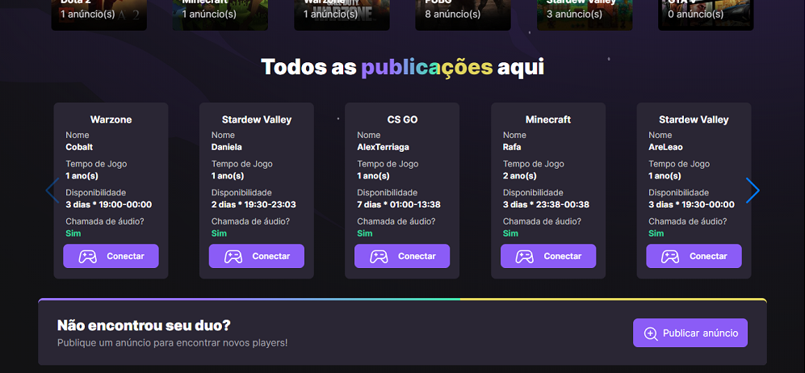
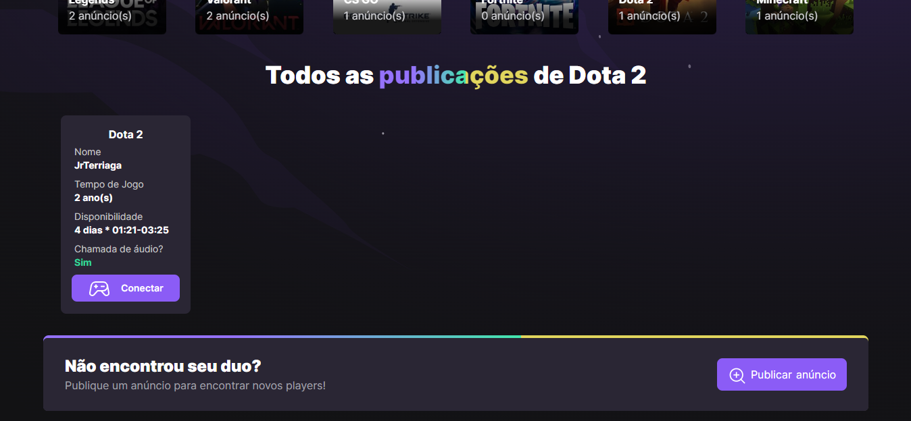
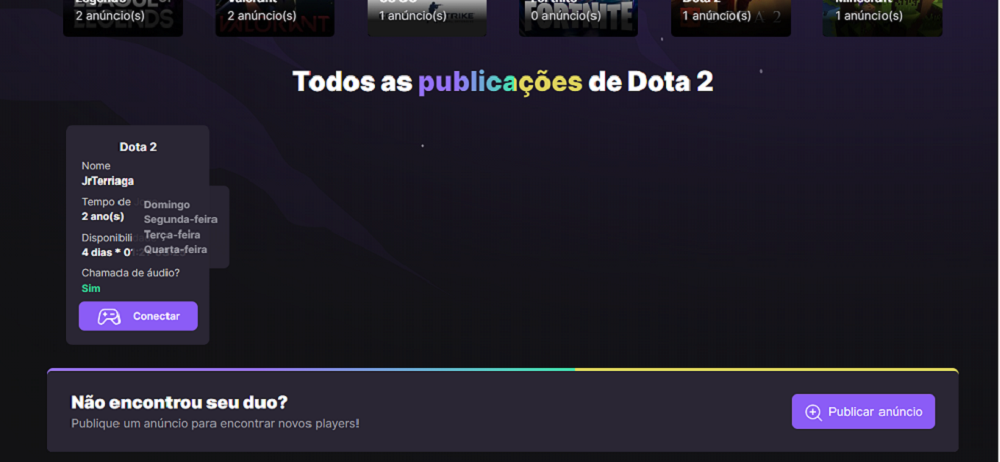
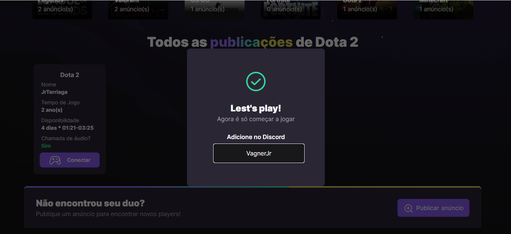
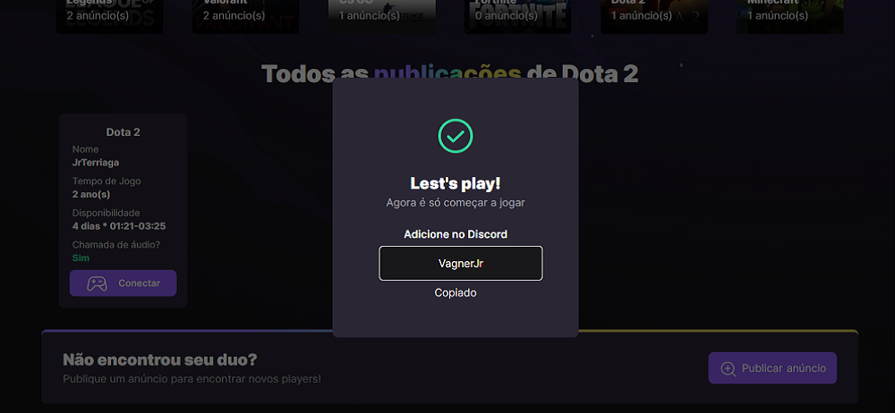
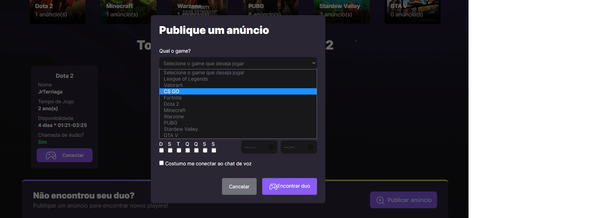
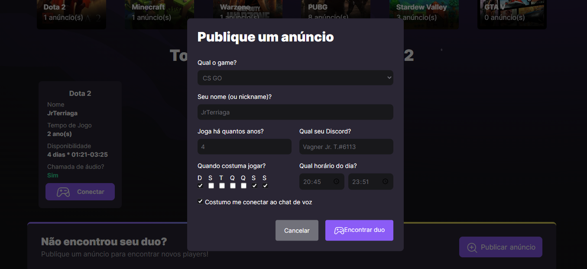
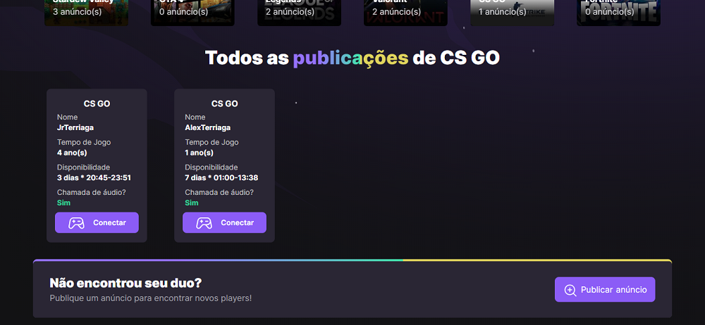

# NLWeSports-Web
## Sobre 
Essa aplicação foi criada para utilização do projeto NLW eSports da Rocket Seat.

Essa aplicação tem como objetivo listar todos os jogos cadastrados na API https://github.com/jrbigmon/NLWeSports-API/ , listar todas as publicações realizadas na plataforma, 
listar todas as aplicações de um único jogo, criar uma publicação e por fim, verificar o "discord" para conectar você a um player que fez uma publicação.

## Como utilizar
### Faça um clone da API e siga o passo a passo da documentação
```bash
git clone https://github.com/jrbigmon/NLWeSports-API.git
```
### Faça o clone para sua máquina dessa aplicação
```bash
git clone https://github.com/jrbigmon/NLWeSports-Web.git
```
### Instale todas as dependências
```bash
npm install
```
### Após instalar, caso queira rodar em ambiente de desenvolvimento, rode:
```bash
npm run dev
```
### Ou utilize o preview, com:
```bash
npm run preview
```

## Telas que o projeto possui
## Home



## Ver todas as Ads de um jogo (Dota2)





## Criar publicação




## Tecnologias utilizadas
### Desenvolvimento 
```json
"devDependencies": {
    "@types/axios": "^0.14.0",
    "@types/react": "^18.0.17",
    "@types/react-dom": "^18.0.6",
    "@vitejs/plugin-react": "^2.1.0",
    "autoprefixer": "^10.4.10",
    "postcss": "^8.4.16",
    "tailwindcss": "^3.1.8",
    "typescript": "^4.6.4",
    "vite": "^3.1.0"
 }
```
### Produção
```json
"dependencies": {
    "@radix-ui/react-dialog": "^1.0.0",
    "axios": "^0.27.2",
    "copy-to-clipboard": "^3.3.2",
    "localforage": "^1.10.0",
    "match-sorter": "^6.3.1",
    "phosphor-react": "^1.4.1",
    "react": "^18.2.0",
    "react-dom": "^18.2.0",
    "react-router-dom": "^6.4.0",
    "sort-by": "^1.2.0",
    "swiper": "^8.3.2"
 }
```

## Muito Obrigado!
