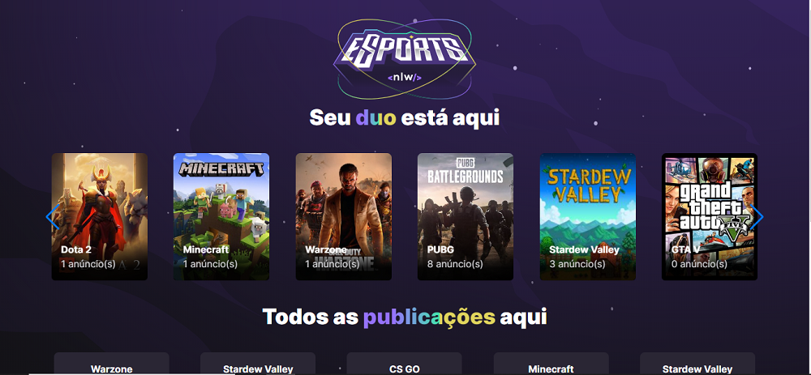
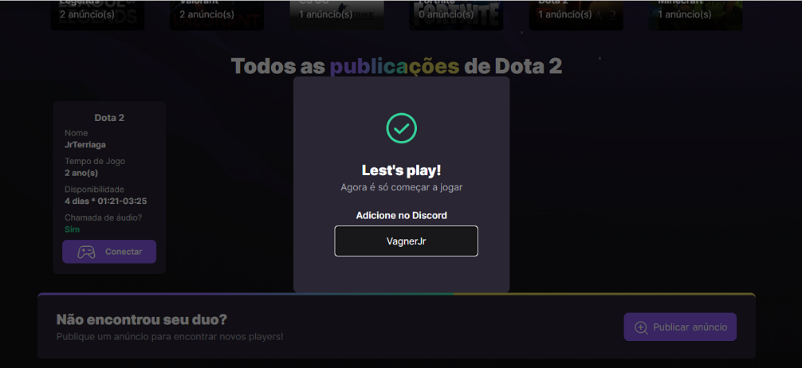
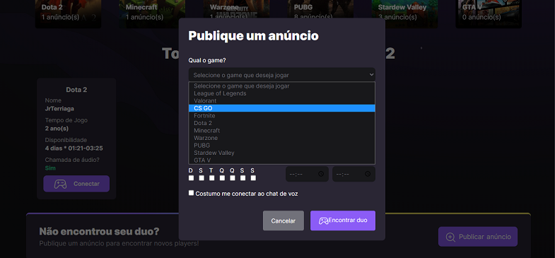
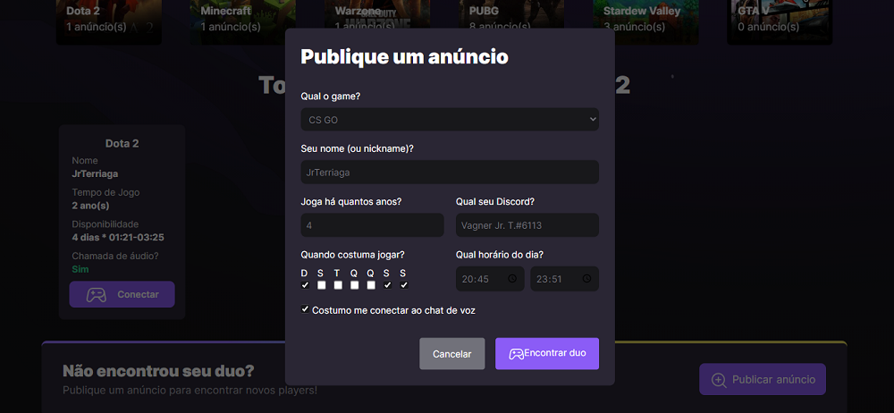

# NLWeSports-API
## Sobre 
Essa aplicação foi criada para utilização do projeto NLW eSports da Rocket Seat.

Essa aplicação tem como objetivo listar todos os jogos cadastrados na API https://github.com/jrbigmon/NLWeSports-API/ , listar todas as publicações realizadas na plataforma, 
listar todas as aplicações de um único jogo, criar uma publicação e por fim, verificar o "discord" para conectar você a um player que fez uma publicação.

## Como utilizar
### Faça um clone da API e siga o passo a passo da documentação
```bash
git clone https://github.com/jrbigmon/NLWeSports-API.git
```
### Faça o clone para sua máquina dessa aplicação
```bash
git clone https://github.com/jrbigmon/NLWeSports-Web.git
```
### Instale todas as dependências
```bash
npm install
```
### Após instalar, caso queira rodar em ambiente de desenvolvimento, rode:
```bash
npm run dev
```
### Ou utilize o preview, com:
```bash
npm run preview
```

## Telas que o projeto possui
### Home


### Ver todas as Ads de um jogo (Dota2)




### Criar publicação


